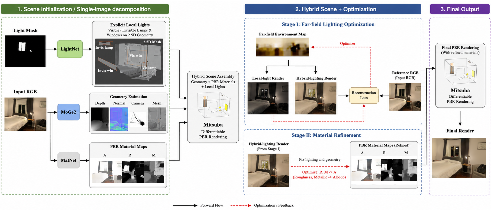
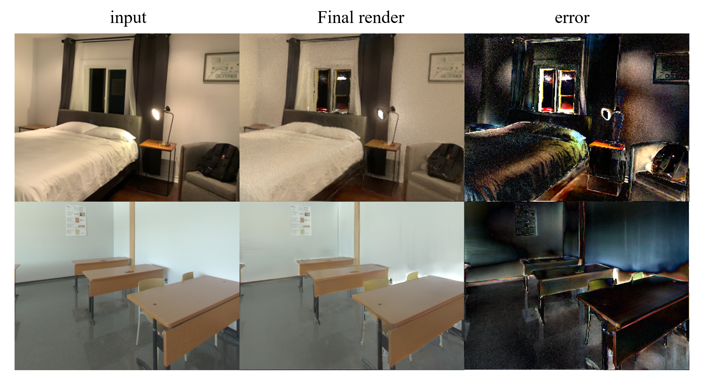
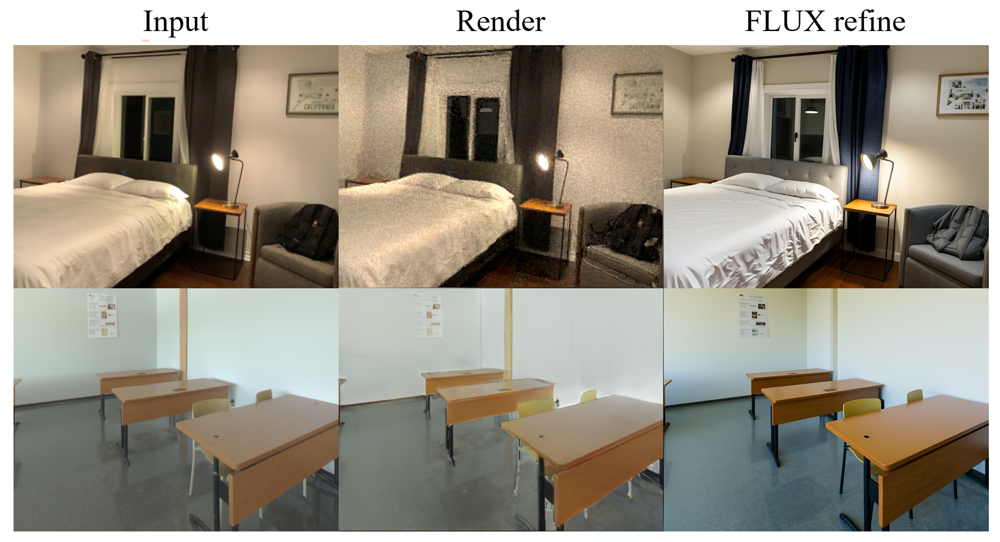

# Materialist Hybrid：单图室内逆渲染与可编辑光照重建当前研究进展

## 1. 总体研究目标

本研究面向单张室内 RGB 图像的逆渲染与可编辑场景重建，目标是从输入图像中联合恢复相机位姿、单视图几何、PBR 材质和室内光照，并将这些结果统一转换为可在 Mitsuba 中进行物理渲染与可微优化的场景。提高输入视角的图像重建质量，提升材质分解结果的物理可解释性和后续图像编辑能力，以支持图像重光照、材质编辑和虚拟物体插入等任务。

当前方法以 Materialist 为主体，将 MoGe2、MatNet 和 IndoorLightEditing 的预测结果进行整合：

1. MoGe2 负责预测相机内参、metric depth、normal 和单视图 2.5D mesh；
2. MatNet 负责预测 albedo、roughness 和 metallic 等初始 PBR 材质；
3. IndoorLightEditing 负责预测 visible/invisible lamp 与 visible/invisible window 的位置、几何和初始光照参数。

在完成坐标系、几何尺度和颜色空间的统一后，系统在 Mitsuba 中构建由显式局部灯光、方向性窗口光和低频远场光共同组成的 Hybrid 物理场景，并通过可微渲染进一步优化初始预测结果。

## 2. 当前研究方法

整体流程：以单张室内 RGB 图像以及图像中显式灯光及窗户掩码作为为输入，首先利用 MoGe2 预测相机内参、深度、法线和单视图 2.5D 几何，利用 MatNet 预测 albedo、roughness 和 metallic 等初始 PBR 材质，同时利用 IndoorLightEditing估计可见与不可见的灯具和窗口光源。在统一坐标系、几何尺度和颜色空间后，系统将场景几何、PBR 材质、显式局部灯光和方向性窗口光共同转换为 Mitsuba 物理场景。随后采用分阶段可微优化策略：先固定几何、材质和局部光源，以输入图像为监督优化低频 far-field 环境光；再固定全部光照，依次优化 roughness、metallic 和 albedo材质信息，从而逐步降低渲染结果与输入图像之间的重建误差，并缓解材质与光照相互补偿的问题。

其中，当前方法采用“显式局部光源 + 低频远场光照”的混合光照表示。Lamp 被建模为具有实际三维位置和有限面积的 mesh area emitter，用于表达距离衰减、局部高光和软阴影。Window 保留 IndoorLightEditing 预测的有限窗口孔径，并使用 sun、sky、ground 三组方向球面高斯描述从窗口进入室内的方向性光照，而不是将窗口简化为均匀的 RGB 面光源。低频 far-field HDRI 则用于补充显式灯光难以解释的画面外照明、环境底色和整体间接光照。

整体优化采用分阶段的块坐标优化思路。首先将 IndoorLightEditing 的显式灯光作为具有物理含义的光照初值，在固定几何、材质和局部灯光的条件下优化低频 far-field，使其主要解释场景中的全局低频照明残差；随后固定已经确定的全部光照，先优化对高光形态影响较大的 roughness 和 metallic，再冻结其最优结果并优化 albedo。这样的优化顺序能够限制不同变量的自由度，减少 far-field、局部灯光和材质相互替代的问题，也能降低 albedo 直接吸收阴影或光照颜色的风险。

stage1 及stage2里面远场光照和材质目前都支持直接参数化与 PosMLP 参数化。直接参数化具有较强的局部表达能力，PosMLP 则提供一定的连续性和平滑先验。优化过程中由 Mitsuba 在线性 RGB/HDR 域完成物理渲染，再将渲染结果转换到与普通输入照片一致的显示域计算重建误差，同时结合参数范围、初始结果约束和独立验证结果控制优化方向。后续还将研究使用二阶球谐函数等更紧凑的低频表示替代当前 HDRI，从而进一步降低远场光照过拟合局部图像细节的可能性。

在上述整体流程之外。为了提升最终渲染质量，目前还尝试利用 FLUX.2 Klein Base 4B 对 PBR 渲染结果进行照片真实化。具体操作是，以 PBR rendered image 为主要参考，以对应的 normal map 为辅助几何参考，通过生成模型，将PBR结果真实化同时尽量保持原有构图、物体、光照、阴影、亮度和整体色感。FLUX 只作为物理渲染后的可视化增强模块，不参与几何、材质和光照参数的求解；后续将进一步探索针对 PBR render-to-photo 任务微调 FLUX 或训练 LoRA，以提高输出的真实性和结构一致性。

## 3. 当前部分实验进展

### 3.1 物理场景重建与渲染测试实验

根据上图pipeline流程，目前在两个场景中进行实验测试，实验结果如下所示：

### 3.2 FLUX PBR渲染真实化测试实验

目前 FLUX 实验仍属于通用基础模型的直接推理，尚未针对本项目的渲染图分布进行Fine-tuning训练。它能够改善视觉真实感，但仍可能重新解释局部物体或修改细节，因而当前只将其作为照片级可视化结果，原始线性 PBR 渲染仍是物理评价和编辑实验的主要依据。

## 4. 当前问题与后续研究计划

当前研究的主要问题集中在三个方面。首先，单张图像中的几何、材质和光照具有较强歧义，单视图 2.5D mesh 也难以完整描述画面外空间和不可见光源的遮挡关系。其次，局部灯光和远场光照之间仍可能相互替代，IndoorLightEditing 的光照强度与 Mitsuba 中的物理辐射度也需要进一步校准。最后，FLUX 照片真实化虽然能够增强视觉细节，但对原始几何、物体语义和光照的一致性仍缺少严格保证，考虑后续是否利用其进行refine。

后续研究将首先完善现有物理优化流程，在更多室内场景上验证 Hybrid 光照表示和分阶段优化方法的稳定性，并系统比较显式局部光、远场光照以及不同材质优化顺序的作用。同时，将探索更紧凑、更稳定的远场光照表示，以及局部灯光与 far-field 的受约束联合优化方法。

在实验评价方面，后续将逐步引入 OpenRooms、InteriorVerse 和真实受控室内场景，建立统一的数据划分、评价指标和实验配置。除输入视角重建外，还将重点评价材质恢复、阴影、留出光照重渲染、灯光编辑、材质编辑和物体插入效果，以判断当前方法是否真正获得了可编辑的物理分解。

